# 双指针总纲

本仓库 36 道双指针题的模板提炼、归类与推导方法。

图里的节点一律单行、不用 `<br/>`：Cursor / VS Code 的 mermaid 预览量不准换行高度，多行字会被切掉一半。字体是 Roboto Mono 12px，后面跟 Consolas / 微软雅黑，避免中文按拉丁字宽排版。

---

## 0. 一句话本质

暴力解通常是枚举一对下标 `(i, j)`，那是一个 `O(n²)` 的二维搜索空间。
**双指针 = 找到一个判据，让你每一步都能整行或整列地砍掉候选，把二维空间走成一条 `O(n)` 的路径。**

所以每道双指针题，真正要想的不是"怎么移动指针"，而是**"凭什么可以移动指针"**——也就是要证明：被丢弃的那批候选里不可能藏着最优解。

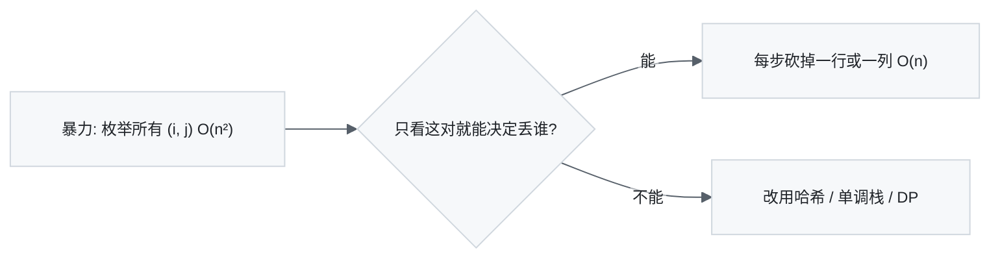

支撑"可以移动"的论证只有三种：

| 论证 | 说法 | 典型题 |
| --- | --- | --- |
| **排除法** | 当前指向的元素不可能出现在任何更优解里，可以永久丢弃 | 15、977、321 |
| **单调性** | 右指针右移时，左指针只会右移不会左移，因此摊还 `O(n)` | 1493、763 |
| **代数不变量** | 两指针的路程差满足一个等式 | 142、160、287 |

---

## 1. 决策树：拿到题先走这一遍

```mermaid
%%{init: {'theme':'base','themeVariables':{'fontFamily':'Roboto Mono, Consolas, Microsoft YaHei, PingFang SC, sans-serif','fontSize':'12px','primaryColor':'#f6f8fa','primaryTextColor':'#1f2328','primaryBorderColor':'#d0d7de','lineColor':'#57606a','secondaryColor':'#eaeef2','tertiaryColor':'#ffffff','background':'#ffffff','mainBkg':'#f6f8fa','clusterBkg':'#ffffff','clusterBorder':'#d0d7de','edgeLabelBackground':'#ffffff','nodeTextColor':'#1f2328'},'flowchart':{'htmlLabels':false,'padding':20,'nodeSpacing':48,'rankSpacing':56,'useMaxWidth':true}}}%%
flowchart TD
    S["读题: 输入是什么形状?"] --> L{"链表或隐式链表?"}
    L -->|是| T4["模板 4  快慢指针"]
    L -->|否| M{"几条独立序列?"}
    M -->|两条| T5["模板 5  双序列双指针"]
    M -->|一条| O{"输出是什么?"}
    O -->|原地改写, 返回新长度| T2["模板 2  读写指针"]
    O -->|连续子数组: 最长 / 最短 / 计数| T3["模板 3  滑动窗口"]
    O -->|首尾对称, 或已排序找配对| T1["模板 1  相向双指针"]
```

模板 4 内部再分一层：

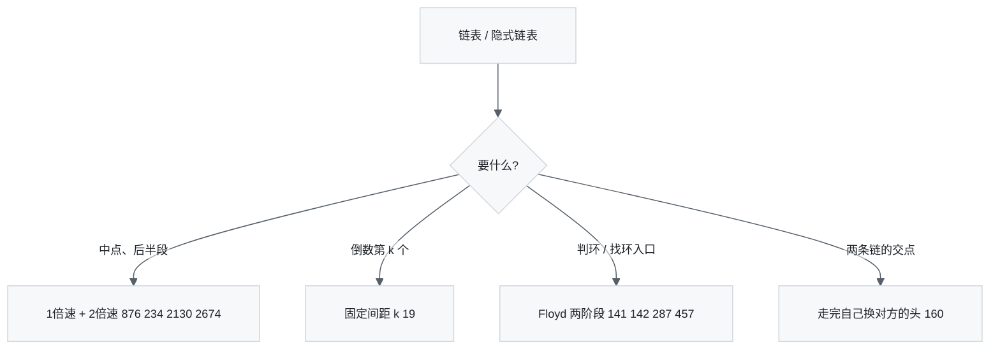

**信号词速查**

| 题面出现 | 大概率是 |
| --- | --- |
| 已排序 + 找两数/三数之和 | 模板 1 |
| 回文、反转、对称 | 模板 1 |
| 原地删除、`O(1)` 额外空间、返回新长度 | 模板 2 |
| 最长/最短的连续子数组、恰好含 k 个 | 模板 3 |
| 链表、环、中点、倒数第 k | 模板 4 |
| 归并、子序列、逐段比较两个字符串 | 模板 5 |

---

## 2. 五大模板

### 模板 1 · 相向双指针

两个指针从两端往中间收，`[i, j]` 之外的部分都已经处理完或已被排除。

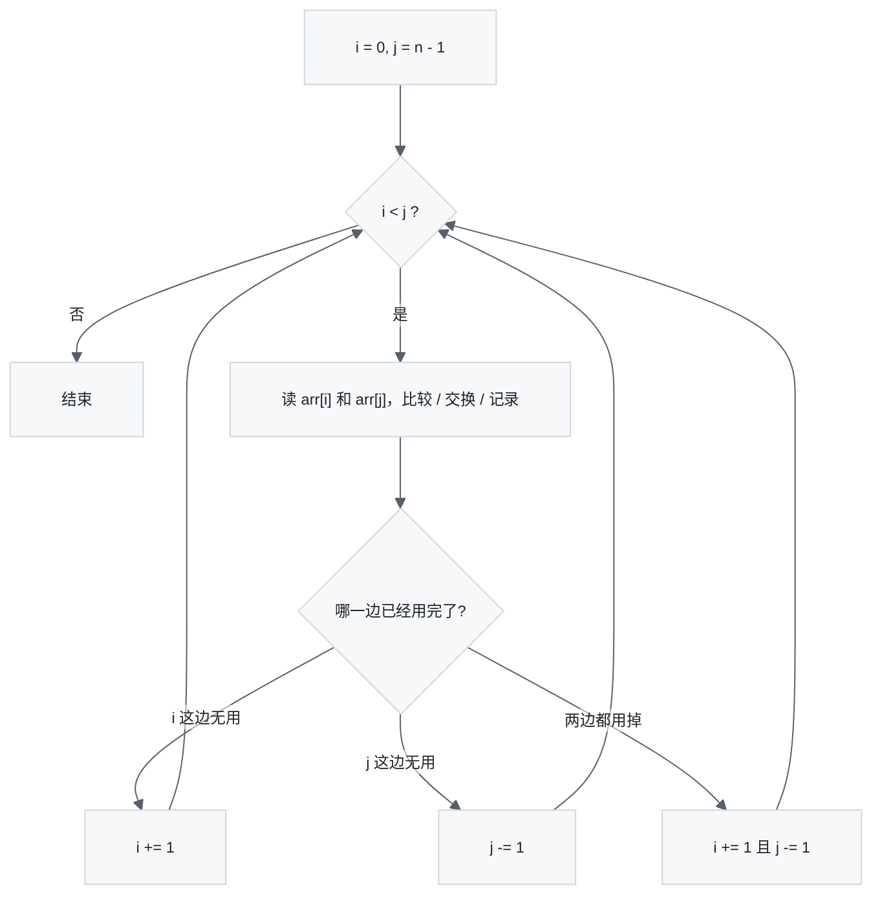

```python
i, j = 0, len(arr) - 1
while i < j:
    # 可选：各自跳过不关心的元素（内层 while 必须再写一次 i < j）
    while i < j and skip(arr[i]): i += 1
    while i < j and skip(arr[j]): j -= 1
    ...
    i += 1
    j -= 1
```

**前提**：数组有序，或者问题本身关于两端对称。
**不变量**：`[0, i)` 和 `(j, n)` 已定稿。

### 模板 2 · 同向读写指针

一个读、一个写，把数组原地压缩成答案。

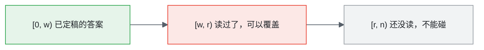

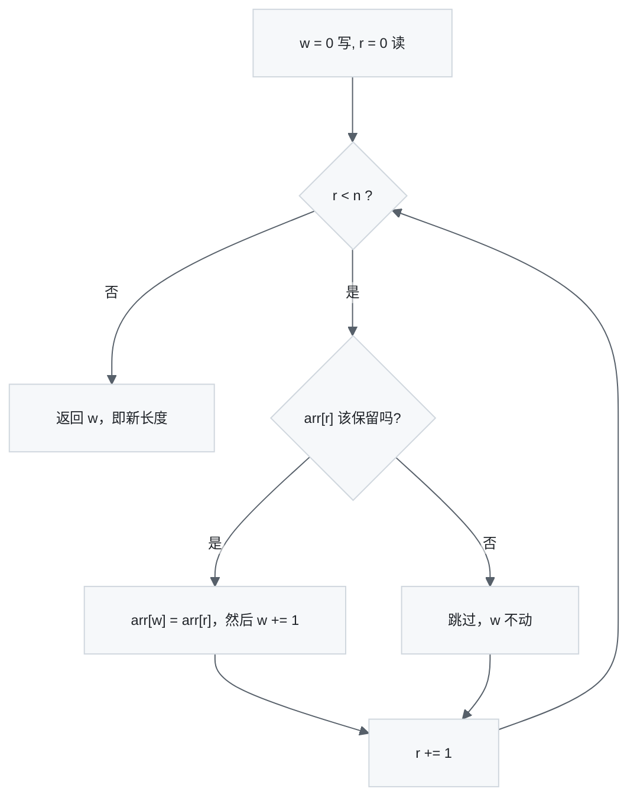

```python
w = 0
for r in range(len(arr)):
    if keep(arr[r]):
        arr[w] = arr[r]
        w += 1
return w
```

**安全性**：`w <= r` 恒成立，所以写操作永远不会覆盖还没读的数据。写复杂变换（比如 443 要写多个字符）时必须单独证明这一点。

### 模板 3 · 滑动窗口

左右都往右走，窗口大小可变。

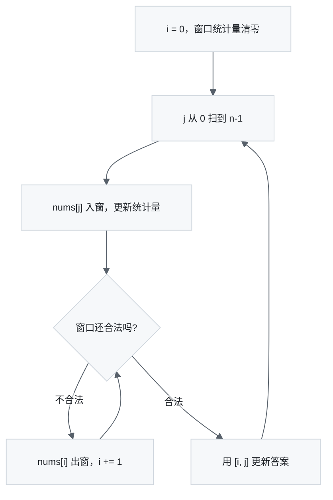

```python
i = 0
for j, x in enumerate(nums):
    add(x)
    while not valid():
        remove(nums[i])
        i += 1
    ans = max(ans, j - i + 1)
```

**前提**：合法性单调——窗口缩小只会更容易合法。这条不成立就套不了模板。
**摊还**：`i` 全程只前进 `n` 次，所以是 `O(n)` 而不是 `O(n²)`。

### 模板 4 · 快慢指针

两个指针速度不同，用它们的路程差做文章。

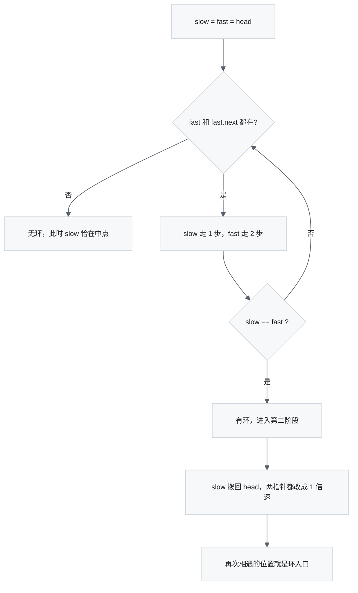

第二阶段为什么成立：

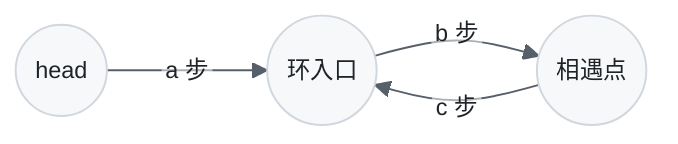

慢指针走了 `a + b`，快指针走了 `a + b + k(b + c)`，而快是慢的两倍，于是
`a + b = k(b + c)` → `a = (k-1)(b+c) + c`。
所以「从 head 走 a 步」和「从相遇点走 c 步再绕几圈」会同时落在入口。

### 模板 5 · 双序列双指针

两条序列，各有各的指针，每轮决定推进哪一边。

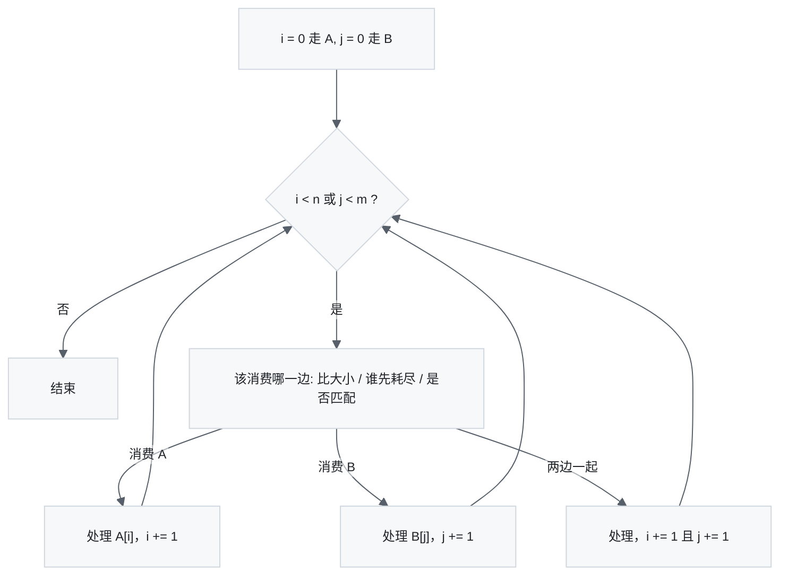

```python
i = j = 0
while i < n or j < m:
    if j >= m or (i < n and should_take_a(a[i], b[j])):
        consume(a[i]); i += 1
    else:
        consume(b[j]); j += 1
```

**关键**：先把「某一边耗尽」的分支写在最前面，剩下的比较逻辑才干净。

---

## 3. 逐题归类

### 模板 1 · 相向双指针（10 题）

| 题 | 文件 | i / j 的含义 | 怎么用模板 |
| --- | --- | --- | --- |
| 344 反转字符串 | `344.py` | 待交换的一对 | 模板裸奔。交换后两边同时定稿，`i += 1; j -= 1` |
| 345 反转元音 | `345.py` | 下一对待交换的元音 | 344 + 跳过。两个内层 `while` 都必须再写一遍 `i < j` |
| 125 验证回文串 | `123.py` ⚠️ | 待比较的一对字母数字 | 345 的骨架，把「交换」换成「比较」，跳过条件换成 `not isalnum()` |
| 680 验证回文串 II | `680.py` | 同上 | 第一次失配时，删的字符**必然**是 `i` 或 `j` 之一，分叉成 `check(i+1, j) or check(i, j-1)`。分叉只发生一次，仍是 `O(n)` |
| 151 反转字符串中的单词 | `151.py` | 待交换的一对**单词** | 先 `split()` 把粒度从字符抬到单词，然后就是 344 |
| 189 轮转数组 | `189.py` | `flip(i, j)` 内的一对 | 344 调三次：全翻 → 翻前 k → 翻后 n−k。原理是 `reverse(reverse(A)+reverse(B)) == B + A`。别忘 `k %= n` |
| 2193 变回文的最少交换 | `2193.py` | 外层收缩的一对 | 见下方详解 |
| 15 三数之和 | `15.py` | 固定 `i` 后，`j`/`k` 是内层的相向指针 | 排序 + 固定一个 + 剩下两数相向。`O(n³) → O(n²)` |
| 977 有序数组的平方 | `977.py` | 两端候选 + 逆序写指针 `k` | 平方后最大值一定在两端，每次取绝对值大的那个，写到结果的**尾部** |
| 75 颜色分类 | `75.py` | `r`/`w`/`b` 三路划分 | 见下方详解 |

⚠️ `123.py` 里装的是 LC **125** Valid Palindrome，文件名写错了（123 是买卖股票 III）。

**2193 详解**——外层是标准相向收缩，但 `s[i] != s[j]` 时不返回，而是从 `j` 往内找第一个等于 `s[i]` 的位置 `k`，用相邻交换把它冒泡到 `j`，代价 `j - k`。如果 `k == i`，说明 `s[i]` 是那个唯一出现奇数次的字符，它最终要待在正中间，代价 `n//2 - i`，此时只推进 `i`。这个贪心的正确性我用 BFS 暴力对拍验证过（字母表 `{a,b,c}`、长度 ≤ 6 的全部可回文串，结果完全一致）。

**75 详解**——不变量是四段：

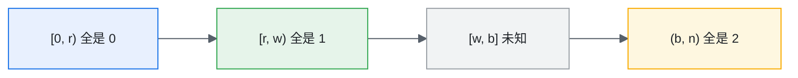

两个容易写错的非对称细节：换到 0 时 `w += 1`（从 `r` 换过来的值一定是 1，因为 `r` 走过的区域只可能是 1），换到 2 时 **`w` 不动**（从 `b` 换过来的值还没检查过）。循环条件是 `w <= b`，不是 `w < b`。

### 模板 2 · 同向读写指针（6 题）

| 题 | 文件 | 写指针语义 | 怎么用模板 |
| --- | --- | --- | --- |
| 26 删除有序数组重复项 | `26.py` | `i` = **最后一个保留元素的下标** | `nums[j] != nums[i]` 才先 `i += 1` 再写，返回 `i + 1` |
| 27 移除元素 | `27.py` | `i` = **下一个写位** | `arr[j] != k` 就写，返回 `i` |
| 443 压缩字符串 | `443.py` | `k` = 下一个写位 | 三指针：`i` 组起点、`j` 组扫描位、`k` 写位 |
| 844 比较含退格的字符串 | `844.py` | `w` = 栈顶 | 用读写指针在原数组上模拟栈：`#` 就 `w -= 1`（防下溢），否则写入 |
| 1861 旋转盒子 | `1861.py` | `k` = 这颗石头该落到的列 | 每行独立做重力下落 |
| 82 删除排序链表中的重复元素 II | `82.py` ⚠️ | `prev` = 已定稿部分的尾巴 | 链表版读写，见文末 bug |

26 和 27 只差一个偏移量，但正是这个偏移最容易写错。**动笔前先决定写指针是「已写个数」还是「最后写的位置」**，两者的初值、更新时机、返回值全都不同。

**443 的安全性**——一组长度 `L` 要写 `1 + len(str(L))` 个字符，而这组本身占了 `L` 个位置。因为 `1 + len(str(L)) <= L` 对所有 `L >= 1` 成立（`L=1` 写 1 个，`L=10` 写 3 个），`k` 永远追不上 `i`，原地写是安全的。

**1861**——从右往左扫每一行，遇 `*`（障碍）就把 `k` 重置成 `c - 1`，遇 `#`（石头）就放到 `k` 再 `k -= 1`。同时用 `result[c][m-r-1]` 一步完成 90° 旋转的坐标映射，省掉了「先转置再翻转」那一趟。

### 模板 3 · 滑动窗口 / 边界推进（3 题）

| 题 | 文件 | 窗口不变量 | 怎么用模板 |
| --- | --- | --- | --- |
| 1493 删掉一个元素后的最长子数组 | `1493.py` | 窗口内最多一个 0 | `count > 1` 就缩左界。答案是 `j - i` 不是 `j - i + 1`，因为必须删掉一个 |
| 2444 统计定界子数组 | `2444.py` | 用三个「最后出现位置」代替左界 | 见下 |
| 763 划分字母区间 | `763.py` | 只有右界会动 | 见下 |

**2444**——左界没法单调推进，于是改记三个位置：`last_low`、`last_high`、`last_out_of_bound`。以 `i` 结尾的合法子数组个数 = `min(last_low, last_high) - last_out_of_bound`（取 0 兜底）。这是滑动窗口的一个重要变体：**当左界不好维护时，改成记录若干关键位置**。文件里两个版本等价，`v2` 把越界时的重置显式写出来，更好读。

**763**——先预处理每个字母的最后出现位置，扫描时不断把右界 `end` 拉大；`i == end` 说明这一段里所有字母都不会再出现在后面，可以切。左界只在切割时跳一次，是「退化的窗口」。

### 模板 4 · 快慢指针（10 题）

| 题 | 文件 | 用法 | 怎么用模板 |
| --- | --- | --- | --- |
| 876 链表的中间结点 | `876.py` | 找中点 | 骨架题。`while fast and fast.next` 返回**后**中点；想要前中点改成 `while fast.next and fast.next.next` |
| 234 回文链表 | `234.py` | 找中点 + 反转 | 快慢找中点 → 反转后半 → 同步比较。循环写 `while fast and slow`，靠较短的那半自然终止 |
| 2130 链表最大孪生和 | `2130.py` | 找中点 + 反转 | 和 234 **一模一样**的骨架，比较换成 `max(fast.val + slow.val)` |
| 2674 拆分循环链表 | `2674.py` | 环形找中点 | 终止条件从 `fast.next` 换成 `y.next != head and y.next.next != head`；偶数长度补一步 `y = y.next` 让 `y` 停在尾巴 |
| 19 删除倒数第 N 个结点 | `19.py` | 固定间距 | `j` 先走 n 步，再同速走到 `j.next` 为空，此时 `i` 正好是待删节点的前驱。dummy 头用来处理「删的就是头」 |
| 141 环形链表 | `141.py` | 判环 | Floyd 第一阶段。快比慢每步多走 1，环内必然追上 |
| 142 环形链表 II | `142.py` | 判环 + 找入口 | 相遇后 `x` 拨回 head，两指针同速走，再次相遇即入口 |
| 287 寻找重复数 | `287.py` | 隐式链表判环 | 见下 |
| 457 环形数组是否存在循环 | `457.py` | 隐式链表判环 + 约束 | 见下 |
| 160 相交链表 | `160.py` | 等距对齐 | 见下 |

234 和 2130 值得放在一起背——**「快慢找中点 + 反转后半段」是一套可复用的组合拳**，出现「链表首尾配对」就是它。

**287**——把 `i -> nums[i]` 看成隐式链表。值域是 `[1, n]` 而下标是 `[0, n]`，所以 0 不会被任何值指向，一定在环外，可以当 head。重复的数就是环入口。识别这类题的信号很硬：**值本身是合法下标**。

**457**——同样是隐式链表，但多了两个约束：环长必须 > 1（`advance` 里 `i == j` 返回 −1），方向必须一致（`(nums[j] > 0) != forward` 返回 −1）。跑完一条路径不管成败都把沿途置 0 标记已访问，这样总复杂度才是 `O(n)` 而不是 `O(n²)`。

**160**——不是快慢，是「等距对齐」：指针走完自己的链就跳到对方的头。两边走的总长都是 `a + c + b`，所以要么在交点相遇，要么同时变成 `None`。

### 模板 5 · 双序列双指针（7 题）

| 题 | 文件 | 消费判据 | 怎么用模板 |
| --- | --- | --- | --- |
| 1768 交替合并字符串 | `1768.py` | 交替，不比较 | 最裸的双序列，`while i < n or j < m`，各自判剩余 |
| 1537 最大得分的路径和 | `1537.py` | 比大小归并 | 见下 |
| 392 判断子序列 | `392.py` | 匹配才推 `i` | `i` 走模式串 `s`，`j` 走文本 `t`；`j` 每轮必推，匹配上才推 `i`。终止后 `i == len(s)` 即成功 |
| 2486 追加字符以获得子序列 | `2486.py` | 同 392 | 和 392 是**同一段代码**，只是变量名对调，返回 `len(t) - j`（还差几个字符） |
| 165 比较版本号 | `165.py` | 逐段解析后比大小 | 见下 |
| 408 有效单词缩写 | `408.py` | 数字就跳，字母就比 | 见下 |
| 321 拼接最大数 | `321.py` | 比剩余后缀 | 见下 |

**1537**——两个有序数组归并，外加一个状态转移：`sum1`/`sum2` 是走到当前位置的两条路径和，碰到公共元素时两条路径合并成 `sum1 = sum2 = max(sum1, sum2) + v`。识别信号是「两个有序数组 + 在相同元素处可以换道」。

**165**——双序列并行解析：两个指针各自把当前 `.` 之前的数字攒出来（`n = n * 10 + d`），比完再各自 `+= 1` 跳过点号。用 `while i < m or j < n` 让短的那边自动补 0，天然处理了 `1.0` vs `1.0.0.0`，前导零也被 `n*10+d` 顺手吃掉了。

**408**——`j` 扫缩写，`i` 在原串上跳。遇数字先查前导零（外层看到的一定是数字首位，因为内层 `while` 会把整个数吃完，所以 `abbr[j] == '0'` 直接判 false 是对的），攒出 `n` 后 `i += n` 并检查越界；遇字母就逐字符比。结束时判 `i == len(s)`，防止原串没消费完。

**321**——复合题，双指针只是零件：单调栈从每个数组选出最优的 k 长子序列，再用双序列**贪心归并**（`greater_suffix` 比较两边的剩余后缀，谁大先取谁），外层枚举从第一个数组取几个。「比剩余后缀」而不是「比当前字符」是这题的核心，相等时必须往后看。

---

## 4. 怎么从题目推导出思路

四步，顺序不要跳。

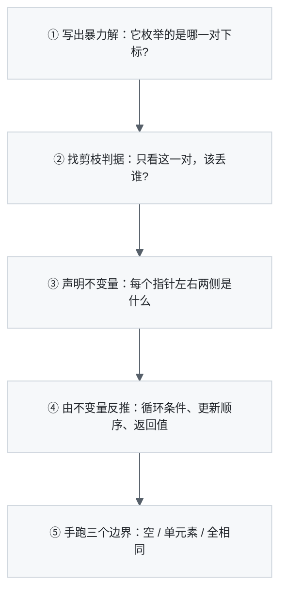

**① 先写暴力解。** 别急着想指针。问自己「最笨的办法是什么」，几乎总是「枚举一对 `(i, j)`」。这一步的产出是：我要优化掉的是哪个二维空间。

**② 找剪枝判据。** 这是唯一有难度的一步，对着三个问题挨个试：

- *只看 `arr[i]` 和 `arr[j]` 能不能确定其中一个"永远没用"？*
  → 能，就是**相向**。15 里 `sum > 0` 说明 `k` 太大（`j` 只会更大，所以 `k` 必须减小）；977 里两端绝对值大的一定是剩余里平方最大的。
- *`j` 右移一格后，`i` 会不会永远不需要退回去？*
  → 是，就是**滑动窗口**。1493 里加入一个 0 只会让窗口更不合法，左界不可能左移。
- *让两个指针速度不同，路程差有没有意义？*
  → 有，就是**快慢**。差 1 倍速 → 中点/判环；差固定 k 步 → 倒数第 k 个。

三个都答不上，说明这题不是双指针，换哈希表、单调栈或 DP。

**③ 声明不变量。** 动笔写循环之前，**用一句话把每个指针左右两侧的语义写死**，最好直接写成注释。比如：

- 模板 2：`[0, w)` 是答案，`[w, r)` 是垃圾，`[r, n)` 没读
- 模板 3：`[i, j]` 是以 `j` 结尾的最长合法窗口
- 75：`[0, r)` 全 0，`[r, w)` 全 1，`[w, b]` 未知，`(b, n)` 全 2

这一句话写清楚了，后面几乎不用思考。

**④ 由不变量反推细节。** 循环条件、更新顺序、返回值全都是不变量的推论，不要靠试。

- 75 的 `w <= b`：因为 `[w, b]` 是**闭区间**的未知区，`b` 上那个还没检查，所以必须取等
- 26 返回 `i + 1`：因为 `i` 的语义是「最后一个保留元素的下标」而不是「个数」
- 1493 答案是 `j - i`：因为窗口长度 `j - i + 1` 里必须扣掉那个被删的元素

**⑤ 手跑边界。** 空输入、单元素、全部相同、`i` 和 `j` 相邻。链表题额外加：只有一个节点、要删的是头节点（这就是 dummy 头存在的理由，19 和 82 都用了）。

---

## 5. 易错点清单

| 坑 | 说明 | 相关题 |
| --- | --- | --- |
| 内层 `while` 漏掉外层边界 | 跳过元素的内层循环必须再写一遍 `i < j`，否则越界或多交换 | 345、125 |
| `<` 还是 `<=` | 未知区是闭区间就必须取等 | 75 |
| 写指针语义混淆 | 「已写个数」和「最后写的位置」的返回值差 1 | 26 vs 27 |
| 交换后指针该不该动 | 换过来的值如果没检查过，指针就不能动 | 75 |
| 窗口答案的长度公式 | `j - i + 1` 还是 `j - i`，取决于要不要扣元素 | 1493 |
| 忘记去重 | 有序数组求组合时，命中后要跳过所有相同值 | 15 |
| 链表少了 dummy 头 | 删除操作可能删到头节点 | 19、82 |
| `fast.next` 判空顺序 | 必须先判 `fast` 再判 `fast.next` | 141、876 |
| 隐式链表的 head 选择 | 287 选 0 是因为 0 不会被任何值指向，一定在环外 | 287 |

---

## 6. 代码里发现的问题

**`82.py` 有 crash。** `dedup` 的内层循环是：

```python
while curr and curr.next.val == dup:
    curr = curr.next
```

当重复段延伸到链表末尾时 `curr.next` 是 `None`，`curr.next.val` 直接抛 `AttributeError`。输入 `[1,2,2]` 就会挂。另外内层退出后 `curr` 停在重复段的**最后一个**节点而不是它之后，`prev.next = curr` 会留下一个本该删掉的节点。正确写法是：

```python
while curr.next and curr.next.val == dup:
    curr = curr.next
curr = curr.next          # 跨过整段重复
prev.next = curr
```

其余 35 份实现我都用测试用例跑过，结果都正确。两处无害的小瑕疵：`15.py` 第 10 行的 `i = 0` 和第 33 行的 `i += 1` 是死代码（`for i in range(...)` 每轮会重新绑定 `i`）；`2486.py` 的返回类型标注写成了 `-> None`，实际返回 `int`。
